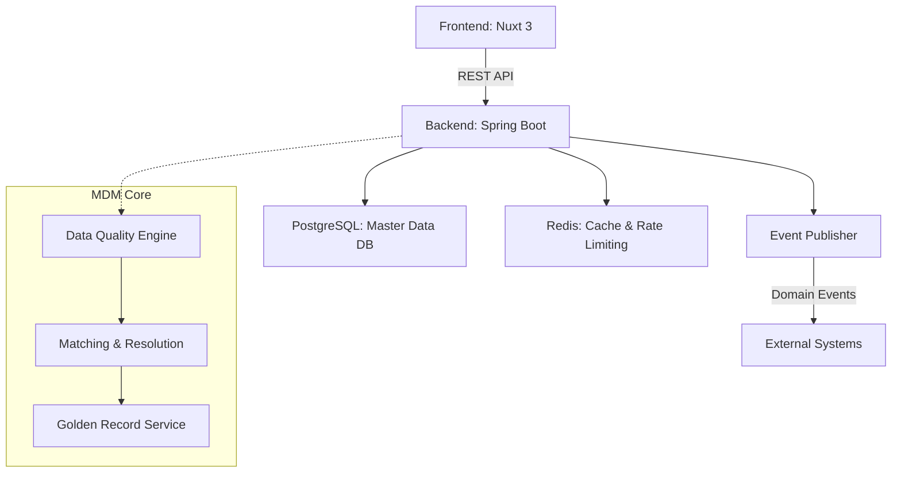

# Master Data Management (MDM) System

이 프로젝트는 조직 내 흩어진 핵심 데이터(Master Data)를 통합, 정제, 일관성 있게 관리하기 위한 Domain / Master Data Management(MDM) 시스템입니다.

## 🎯 Project Purpose
기업의 핵심 데이터인 Customer, Product 등의 마스터 데이터를 중앙 집중식으로 관리하여, 데이터의 일관성 및 품질을 확보하고 Golden Record를 생성하는 것을 목표로 합니다.

### Supported Domains
- **Customer**: 고객 기본 정보, 연락처 등
- **Product**: 상품 정보, 카테고리 등
- 향후 추가 도메인 확장 가능 구조 (Vendor, Employee 등)

## 🏛 Architecture Overview



## 🛠 Tech Stack
- **Frontend**: Nuxt 3, Vue 3, TypeScript, Vuestic UI
- **Backend**: Spring Boot 3.x, Java 17, Spring Data JPA, Spring Security, Spring Events
- **Database**: PostgreSQL 15, Redis
- **Infra**: Docker Compose

## 🚀 Quick Start

### 1. 환경 변수 설정
```bash
cp .env.example .env
# .env 파일을 열어 필요한 설정을 입력합니다.
```

### 2. 인프라 실행 (Docker Compose)
데이터베이스 및 기타 필수 인프라 컨테이너를 구동합니다.
```bash
docker-compose up -d
```

### 3. 백엔드 서버 구동
```bash
cd backend
./mvnw spring-boot:run
```

### 4. 프론트엔드 서버 구동
```bash
cd frontend
npm install
npm run dev
```

## 📚 Data Model & Domain Setup Guide
시스템은 정형화된 데이터 모델 대신, 관리자가 런타임에 데이터 스키마를 구성할 수 있는 **동적 도메인 메타데이터(Dynamic Domain Metadata)** 구조를 사용합니다.

새로운 도메인(예: 임직원, 상품, 거래처)을 구성할 때는 다음 계층 구조와 규칙을 따라야 합니다.

### 1. Domain (최상위 기준)
전체 데이터를 포괄하는 최상위 개념입니다.
* **필수 설정 (Domain Field Mappings)**:
  * **Identifier Field**: 데이터를 식별하는 고유 키(예: 사번, 상품코드). 반드시 지정되어야 합니다.
  * **Display Name Field**: 화면에 대표로 표시될 이름(예: 이름, 상품명). 프론트엔드 기획 의도에 따라 반드시 **`MULTILINGUAL` (다국어)** 타입의 필드로 생성하고 매핑해야 정상적으로 선택/동작합니다.

### 2. Classification Node (분류 트리)
도메인 하위의 논리적인 계층 구조나 카테고리를 나타냅니다. 좌측 트리 메뉴에 표시됩니다.
* 예: 임직원 도메인의 하위 노드로 `정규직`, `계약직`, `임원`, `프리랜서` 등을 생성.
* 모든 데이터(레코드)와 워크플로우 결재선은 이 Classification Node 단위로 매핑되거나 동작합니다.

### 3. Sector & Group (UI 레이아웃 및 폼 구성)
데이터 입력 화면(Form)을 어떻게 렌더링할지 결정하는 시각적 묶음입니다.
* **Sector**: 입력 화면의 **메인 탭(Tab)** 역할을 합니다. (예: `일반`, `상세 정보`)
* **Field Group**: Sector 내부에서 필드들을 묶어주는 **섹션/그룹** 역할을 합니다. (예: `기본 정보`, `직무 정보`, `연락처`)
* ⚠️ **주의사항**: 필드를 여러 분류(정규직, 계약직 등)마다 반복 생성하는 것이 아닙니다. Sector와 Group은 단순히 화면을 그리는 용도이므로 `일반`과 같이 공통 탭을 하나만 만들고 그 안에 필드를 한 번만 정의하면 됩니다. 이 필드들은 도메인 내의 모든 Classification Node에서 자동으로 상속되어 재사용됩니다.

### 4. Field (데이터 항목)
실질적인 데이터 컬럼 역할을 합니다.
* 각 필드는 반드시 하나의 `Group`에 속해야 합니다.
* 텍스트(STRING), 숫자(NUMBER), 날짜(DATE), 다국어(MULTILINGUAL) 등 다양한 데이터 타입을 지원합니다.
* 대표 이름으로 쓰일 필드는 생성 시 타입을 `MULTILINGUAL`로 설정해야 도메인의 Display Name Field로 지정할 수 있습니다.

### 도메인 셋팅 순서 (REST API 기준)
새로운 도메인을 스크립트나 API로 셋팅할 때는 다음 순서를 따릅니다.
1. **Domain 생성**: `POST /api/domains`
2. **Classification Node 생성**: `POST /api/domains/{domainId}/nodes`
3. **Sector 생성**: `POST /api/domains/{domainId}/sectors`
4. **Group 생성**: `POST /api/domains/{domainId}/groups` (생성된 Sector ID 필요)
5. **Field 생성**: `POST /api/domains/{domainId}/fields` (생성된 Group ID 필요)
6. **Domain 업데이트 (필드 매핑)**: `PUT /api/domains/{domainId}` (생성된 Identifier 필드와 Display Name 필드의 ID를 지정)
