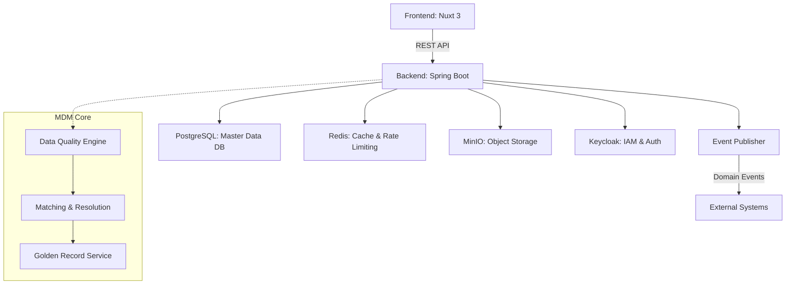

# Master Data Management (MDM) System

이 프로젝트는 조직 내 흩어진 핵심 데이터(Master Data)를 통합, 정제, 일관성 있게 관리하기 위한 Domain / Master Data Management(MDM) 시스템입니다.

## 🎯 Project Purpose (프로젝트 전체 목표)
초기에는 각 부서나 시스템별로 파편화된 **Domain Management** 기능을 제공하여 개별 데이터를 관리하는 수준에서 시작했습니다. 하지만 궁극적인 목표는 **Master Data Management(MDM) 플랫폼으로의 진화**입니다. 
기업의 핵심 데이터인 Customer, Product, Vendor, Employee 등의 마스터 데이터를 중앙 집중식으로 수집하고, 데이터 품질(Data Quality)을 검증하여, 중복을 제거한 **Golden Record**를 생성하고 이를 외부 시스템으로 전파하는 것을 목표로 합니다.

## 🏛 Architecture Overview
이 시스템은 Frontend와 Backend가 완전히 분리된 구조를 가지며, REST API를 통해 통신합니다. 런타임에 동적으로 스키마를 구성하는 메타데이터 드리븐 아키텍처를 채택했습니다.



## 🛠 Tech Stack 상세
- **Frontend**
  - **Framework**: Nuxt 3 (v3.17.7), Vue 3
  - **Language**: TypeScript
  - **UI Library**: Vuestic UI (v1.10.3)
  - **Data Grid & Chart**: AG Grid Vue3 (v31.3.4), Apache ECharts (v5.6.0)
- **Backend**
  - **Framework**: Spring Boot 4.1.0
  - **Language**: Java 17
  - **ORM**: Spring Data JPA, Hibernate, Spring Data Envers
  - **Security**: Spring Security, JWT (jjwt 0.11.5)
- **Database & Infrastructure**
  - **RDBMS**: PostgreSQL 15 (PostGIS 포함)
  - **Cache**: Redis 7
  - **Storage**: MinIO (S3 호환 Object Storage)
  - **IAM**: Keycloak 24.0
  - **Container**: Docker & Docker Compose

## 🚀 Quick Start

### 1. 환경 변수 설정
최상위 디렉토리에 `.env` 파일을 생성하고 설정을 입력합니다. (예시 파일 활용)
```bash
cp .env.example .env
```

### 2. 인프라 실행 (Docker Compose)
데이터베이스 및 기타 필수 인프라(Postgres, Redis, Keycloak, MinIO) 컨테이너를 구동합니다.
```bash
docker-compose up -d
```

### 3. 백엔드 서버 구동
Spring Boot 애플리케이션을 실행합니다. 기본적으로 `8080` 포트를 사용합니다.
```bash
cd backend
./mvnw clean spring-boot:run
```

### 4. 프론트엔드 서버 구동
Nuxt 애플리케이션을 실행합니다. 기본적으로 `3000` 포트를 사용합니다.
```bash
cd frontend
npm install
npm run dev
```

## 🔑 Key Features

**[현재 구현된 기능]**
- **Dynamic Domain Setup**: 하드코딩된 테이블 스키마 없이, 런타임에 Domain, Classification Node, Sector, Group, Field 등을 동적으로 구성하는 메타데이터 관리 시스템.
- **Workflow & Approval System**: 동적 결재선 지정, 다단계 승인(Pending, Approved, Rejected) 로직 처리, 반려 및 히스토리 관리.
- **Server-Side Pagination & Optimization**: 대규모 레코드 조회를 위한 DB 레벨의 페이징 처리 및 카운트 최적화.
- **Dynamic Field Calculations**: 지정된 수식에 따라 필드 값을 런타임에 재계산.

**[Roadmap (향후 구현 목표)]**
- **Data Quality Engine (DQE)**: 규칙(Ruleset) 기반의 데이터 정합성 검사 및 정제 자동화.
- **Matching & Deduplication**: 유클리디안 거리, 레벤슈타인 거리 등 알고리즘을 통한 중복 데이터 판별.
- **Golden Record Generation**: 여러 소스에서 들어온 레코드를 병합하여 하나의 완벽한 마스터 데이터(Golden Record) 구축.
- **External System Sync**: 카프카(Kafka) 또는 웹훅(Webhook)을 통한 외부 시스템 연동 및 변경분 실시간 전파.

## 📚 Data Model 개요
시스템은 정형화된 데이터 모델 대신, 런타임에 데이터 스키마를 구성할 수 있는 **동적 도메인 메타데이터(Dynamic Domain Metadata)** 구조를 사용합니다.

1. **Domain**: 최상위 기준(예: 임직원, 상품, 거래처).
   * Identifier Field 및 Display Name Field(MULTILINGUAL 필수) 지정 필수.
2. **Classification Node**: 도메인 하위의 분류 트리 (예: 정규직, 계약직). 데이터와 결재 워크플로우의 기준 단위.
3. **Sector & Group**: 화면 입력을 구성하는 탭(Sector)과 그룹(Group). 노드 간에 공통으로 상속 및 재사용됩니다.
4. **Field**: 실제 데이터 항목. (STRING, NUMBER, DATE, CALCULATED, MULTILINGUAL 등 지원).
5. **Record & Approval**: 생성/수정/삭제 시 `ApprovalRequest`로 묶이며 승인 완료 후 버저닝되어 `Record`가 활성화(`ACTIVE`)됩니다.

## 🌐 API Base URL & 주요 Endpoint
- **Base URL**: `http://localhost:8080/api`
- **주요 Endpoints**:
  - `GET /api/domains` : 도메인 목록 조회
  - `POST /api/domains` : 신규 도메인 생성
  - `GET /api/domains/{id}/nodes` : 도메인 하위 분류 노드 조회
  - `GET /api/records` : 마스터 데이터 레코드 조회 (검색 및 페이징 지원)
  - `POST /api/records/nodes/{nodeId}` : 데이터 생성 (결재 요청)
  - `GET /api/approval-requests` : 결재 요청 목록 및 상태 조회
  - `POST /api/approval-requests/steps/{stepId}/approve` : 단계별 결재 승인

## 🤝 Contributing Guide
1. **Branch 전략**: `feature/기능명` 브랜치를 생성하여 작업합니다.
2. **TDD 기반 개발**: 버그 수정 및 새로운 기능 추가 시, 반드시 단위 테스트(JUnit 등) 코드를 먼저 작성하고 통과한 후 반영합니다. (사이드 이펙트 방지)
3. **안전한 DB 작업**: 테이블 `TRUNCATE` 명령어는 절대 사용하지 않으며, 문제가 되는 레코드를 명시적으로 조회하여 삭제(`DELETE`)하는 방식으로 작업합니다.
4. **Commit 메시지 규약**: `feat: ~`, `fix: ~`, `refactor: ~` 등 명확한 접두사를 사용합니다.
5. 작업 완료 시 Pull Request(PR)를 올려 코드 리뷰를 거친 후 Main에 병합합니다.
