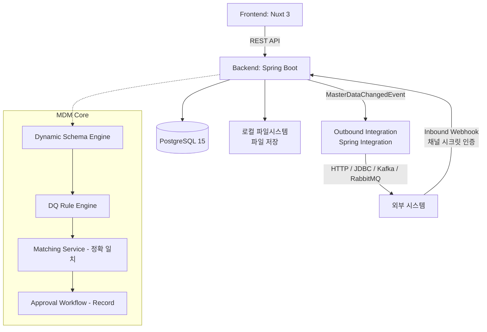

# Master Data Management (MDM) System

이 프로젝트는 조직 내 흩어진 핵심 데이터(Master Data)를 통합, 정제, 일관성 있게 관리하기 위한 Domain / Master Data Management(MDM) 시스템입니다.

## 🎯 Project Purpose (프로젝트 전체 목표)
초기에는 각 부서나 시스템별로 파편화된 **Domain Management** 기능을 제공하여 개별 데이터를 관리하는 수준에서 시작했습니다. 하지만 궁극적인 목표는 **Master Data Management(MDM) 플랫폼으로의 진화**입니다.
기업의 핵심 데이터인 Customer, Product, Vendor, Employee 등의 마스터 데이터를 중앙 집중식으로 수집하고, 데이터 품질(Data Quality)을 검증하여, 중복을 제거한 **Golden Record**를 생성하고 이를 외부 시스템으로 전파하는 것을 목표로 합니다.

> 현재 상태: 동적 스키마, 승인 워크플로우, DQ 룰 엔진, 정확 일치 기반 중복 검사, 인바운드/아웃바운드 연계까지는 구현되어 있으며, 여러 소스 레코드를 하나로 병합하는 Golden Record 생성(서바이버십)은 아직 로드맵 단계입니다. 세부 내용은 [🔑 Key Features](#-key-features) 참고.

## 🏛 Architecture Overview
Frontend와 Backend가 완전히 분리된 구조로 REST API를 통해 통신하며, 런타임에 동적으로 스키마를 구성하는 메타데이터 드리븐 아키텍처를 채택했습니다.



> **보안 및 인프라 안내:** 
> - 백엔드는 Spring Security 기반 자체 JWT 토큰 인증 방식을 사용합니다.
> - `application.yml`은 `JWT_SECRET`, `DB_USERNAME`, `DB_PASSWORD` 등 환경변수를 필수로 참조합니다.

## 🛠 Tech Stack 상세
- **Frontend**
  - **Framework**: Nuxt 3 (^3.17.7), Vue 3
  - **Language**: TypeScript (^5.9.3)
  - **UI Library**: Vuestic UI (^1.10.3)
  - **Data Grid & Chart**: AG Grid Vue3 / Enterprise (^34.3.1), Apache ECharts (^5.6.0)
  - **i18n**: @nuxtjs/i18n (한국어 기본, 영어 지원)
- **Backend**
  - **Framework**: Spring Boot 4.1.0
  - **Language**: Java 17
  - **ORM**: Spring Data JPA, Hibernate, Spring Data Envers
  - **Security**: Spring Security, 자체 발급 JWT (jjwt) — 환경변수(`JWT_SECRET`) 필수 참조
  - **Integration**: Spring Integration (HTTP / JDBC / Event), Spring Retry, Spring Kafka, Spring AMQP(RabbitMQ) — 아웃바운드 연계 채널용
- **Database & Infrastructure**
  - **RDBMS**: PostgreSQL 15
  - **Container**: Docker & Docker Compose (Postgres 기본 제공)

## 📌 [Roadmap / 향후 확장 예정 인프라]
- **Keycloak**: 외부 IAM (OAuth2 / OIDC) 로그인 연동 준비 중
- **Redis**: 분산 세션 / API Rate Limiting 및 캐싱 레이어 도입 예정
- **MinIO**: 오브젝트 스토리지 첨부파일 관리 도입 예정

## 🚀 Quick Start

### 1. 환경 변수 설정
최상위 디렉토리의 `.env.example`을 복사하여 `.env` 파일을 작성합니다.
```bash
cp .env.example .env
```
필요한 경우 `.env` 파일 내 `JWT_SECRET`, `DB_USERNAME`, `DB_PASSWORD` 등을 프로젝트 실행 환경에 맞추어 수정합니다.

### 2. 인프라 실행 (Docker Compose)
```bash
docker-compose up -d
```
기본적으로 PostgreSQL 데이터베이스가 기동됩니다.

### 3. 백엔드 서버 구동
백엔드는 환경변수 주입을 필수로 요구합니다. CLI 또는 IDE에서 `.env` 환경변수를 로드하여 구동하거나 아래 명령어로 구동할 수 있습니다:
```bash
cd backend
export JWT_SECRET="your_jwt_secret_key_which_must_be_at_least_256_bits_long_for_hs256_security"
export DB_USERNAME="postgres"
export DB_PASSWORD="your_postgres_password_here"
./mvnw clean spring-boot:run
```

### 4. 프론트엔드 서버 구동
```bash
cd frontend
npm install
npm run dev
```

## 🔑 Key Features

**[구현 완료]**
- **Dynamic Domain / Schema Engine**: 하드코딩된 테이블 스키마 없이 Domain → Classification Node(트리, 필드 상속) → FieldGroup/Sector → FieldDefinition을 런타임에 동적으로 구성.
- **Record 승인 워크플로우**: 레코드 생성/수정/삭제 시 다단계 결재(Pending → Approved/Rejected), 결재자별 Before/After 비교 및 코멘트, 반려 시 원본 데이터 유지.
- **Data Quality Rule Engine**: NotNull, Regex, Range, Length, Enum, DateRange, CrossField, Unique, SpEL(커스텀 수식) 등 룰 기반 검증기.
- **Matching / 중복 검사**: 도메인 식별자 필드, candidate key(코드/번호성 필드), 커스텀 매칭 룰을 기반으로 한 정확 일치(EQ) 중복 탐지.
- **외부 시스템 연계 (Integration)**: Inbound(채널별 시크릿 토큰 인증 Webhook)와 Outbound(Spring Integration 기반 HTTP/JDBC/Kafka/RabbitMQ 동적 라우팅).
- **RBAC 및 조직 구조**: Role/UserRole 기반 권한, Organization/Department/Team 조직도, 도메인·노드 단위 세부 권한(`DomainPermission`).
- **데이터 변경 감사(Audit)**: `RecordHistory`에 생성/수정/삭제 스냅샷을 버전과 함께 저장.
- **다국어(i18n)**: 한국어/영어 UI, 필드 자체 다국어 지원.

**[부분 구현 / 알려진 한계]**
- Matching은 **정확 일치(EQ)** 만 지원하며, 유사도 기반(퍼지 매칭) 판별은 아직 없음.
- 인바운드 연계에서 중복이 감지되면 **레코드 전체를 새 데이터로 덮어쓰는 방식**으로 갱신됨 — 필드 단위 병합이나 소스 시스템별 신뢰도(서바이버십) 규칙은 없음.
- 스키마(필드/노드) 변경은 승인 절차 없이 **즉시 반영**되며, 데이터(Record)와 달리 스키마 변경 이력(감사 로그)도 아직 없음.
- DQ 전체 재검사는 관리자가 수동으로 트리거하는 방식이며, 주기적 자동 스캔(스케줄러)은 없음.

**[기능 Roadmap]**
- **Golden Record 생성 (Merge & Survivorship)**: 여러 소스/중복 레코드를 필드 단위 신뢰도 규칙으로 병합해 대표 레코드를 구성.
- **매칭 후보 검토 큐**: 애매한(높은 유사도이지만 완전 일치는 아닌) 매칭 건을 데이터 스튜어드가 검토·승인하는 화면.
- **스키마 변경 승인 워크플로우 및 스키마 감사 로그**.

## 🧪 Testing
백엔드는 `backend/src/test/java`에 컨트롤러/서비스/리포지토리 단위의 JUnit 테스트가 다수(43개 클래스) 구성되어 있습니다. 새 기능 추가나 버그 수정 시 관련 범위의 테스트를 먼저 확인하고, 필요한 경우 테스트를 추가/보완하는 것을 권장합니다.
```bash
cd backend
./mvnw test
```

## 📚 Data Model 개요
시스템은 정형화된 데이터 모델 대신, 런타임에 데이터 스키마를 구성할 수 있는 **동적 도메인 메타데이터(Dynamic Domain Metadata)** 구조를 사용합니다.

1. **Domain**: 최상위 기준(예: 임직원, 상품, 거래처). Identifier Field 및 Display Name Field 지정 필수.
2. **Classification Node**: 도메인 하위의 분류 트리 (예: 정규직, 계약직). 데이터와 결재 워크플로우의 기준 단위이며, 도메인 자체도 트리의 루트 노드로 취급됨.
3. **Sector & Group**: 화면 입력을 구성하는 탭(Sector)과 필드 그룹(FieldGroup). 노드 간에 공통으로 상속·재사용됨.
4. **Field (FieldDefinition)**: 실제 데이터 항목 정의. 텍스트/숫자/날짜/선택/다국어/파일/참조 등 다양한 타입을 지원하며, 정의된 노드와 모든 하위 노드에 상속됨.
5. **Record & Approval**: 생성/수정/삭제 요청이 `ApprovalRequest` + `ApprovalStep`으로 묶여 다단계 결재를 거치고, 최종 승인 후 `Record`가 버전과 함께 활성화(`ACTIVE`)됨.
6. **DQ Rule / DQ Violation**: 필드 또는 노드 단위로 정의되는 데이터 품질 규칙과, 위반 이력.
7. **Matching Rule**: 도메인/노드 단위로 정의되는 중복 판별 대상 필드 조합.
8. **Integration Channel / Integration Log**: 외부 시스템과의 연계 채널 설정(Inbound/Outbound, 타입, 매핑 규칙)과 연계 처리 이력.

## 🌐 API Base URL & 주요 Endpoint
- **Base URL**: `http://localhost:8080/api`

| 구분 | Method & Path | 설명 |
|---|---|---|
| 도메인/스키마 | `GET /domains` | 도메인 목록 조회 |
| 도메인/스키마 | `POST /domains` | 신규 도메인 생성 |
| 도메인/스키마 | `GET /domains/{id}/nodes` | 도메인 하위 분류 노드 조회 |
| 데이터 품질 | `GET /domains/{domainId}/dq-score` | 도메인 DQ 점수 조회 |
| 데이터 품질 | `POST /domains/{domainId}/dq-scan` | 도메인 전체 레코드 DQ 재검사 실행 |
| 데이터 품질 | `GET /domains/{domainId}/dq-violations` | DQ 위반 목록 조회 (페이징) |
| 레코드 | `POST /nodes/{nodeId}/records` | 데이터 생성 (결재 기안) |
| 레코드 | `GET /records/domain/{domainId}` | 도메인 기준 레코드 조회 (검색·페이징) |
| 레코드 | `POST /records/{id}/update-request` | 레코드 수정 요청 (결재 기안) |
| 레코드 | `POST /records/{id}/delete-request` | 레코드 삭제 요청 (결재 기안) |
| 결재 | `GET /approval-requests/todos` | 내 결재함(대기 목록) 조회 |
| 결재 | `POST /approval-requests/steps/{stepId}/approve` | 단계별 결재 승인 |
| 연계 | `POST /integration/inbound/{channelId}` | 외부 시스템 인바운드 데이터 수신 (채널 시크릿 인증) |
| 연계 | `GET /admin/integration/channels` | 연계 채널 목록 조회 |

## 🤝 Contributing
기여 방법, 브랜치 전략, 커밋 규약 등은 [`CONTRIBUTING.md`](./CONTRIBUTING.md)를 참고해 주세요.
