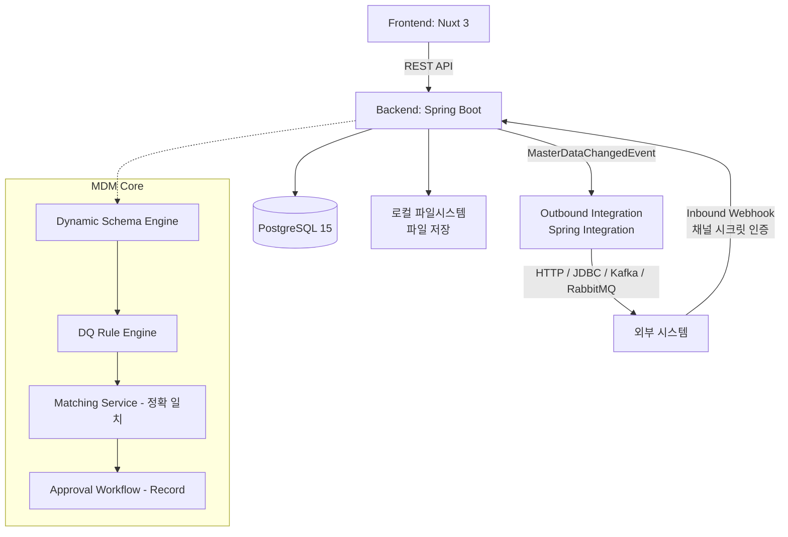

# Master Data Management (MDM) System

이 프로젝트는 조직 내 흩어진 핵심 데이터(Master Data)를 통합, 정제, 일관성 있게 관리하기 위한 Domain / Master Data Management(MDM) 시스템입니다.

## 🎯 Project Purpose (프로젝트 전체 목표)
초기에는 각 부서나 시스템별로 파편화된 **Domain Management** 기능을 제공하여 개별 데이터를 관리하는 수준에서 시작했습니다. 하지만 궁극적인 목표는 **Master Data Management(MDM) 플랫폼으로의 진화**입니다.
기업의 핵심 데이터인 Customer, Product, Vendor, Employee 등의 마스터 데이터를 중앙 집중식으로 수집하고, 데이터 품질(Data Quality)을 검증하여, 중복을 제거한 **Golden Record**를 생성하고 이를 외부 시스템으로 전파하는 것을 목표로 합니다.

> 현재 상태: 동적 스키마, 승인 워크플로우, DQ 룰 엔진, 정확 일치 기반 중복 검사, 인바운드/아웃바운드 연계까지는 구현되어 있으며, 여러 소스 레코드를 하나로 병합하는 Golden Record 생성(서바이버십)은 아직 로드맵 단계입니다. 세부 내용은 [🔑 Key Features](#-key-features) 참고.

## 🏛 Architecture Overview
Frontend와 Backend가 완전히 분리된 구조로 REST API를 통해 통신하며, 런타임에 동적으로 스키마를 구성하는 메타데이터 드리븐 아키텍처를 채택했습니다.



> **보안 및 인프라 안내:** 
> - 백엔드는 Spring Security 기반 자체 JWT 토큰 인증 방식을 사용합니다.
> - `application.yml`은 `JWT_SECRET`, `DB_USERNAME`, `DB_PASSWORD` 등 환경변수를 필수로 참조합니다.

## 🛠 Tech Stack 상세
- **Frontend**
  - **Framework**: Nuxt 3 (^3.17.7), Vue 3
  - **Language**: TypeScript (^5.9.3)
  - **UI Library**: Vuestic UI (^1.10.3)
  - **Data Grid & Chart**: AG Grid Vue3 / Enterprise (^34.3.1), Apache ECharts (^5.6.0)
  - **i18n**: @nuxtjs/i18n (한국어 기본, 영어 지원)
- **Backend**
  - **Framework**: Spring Boot 4.1.0
  - **Language**: Java 17
  - **ORM**: Spring Data JPA, Hibernate, Spring Data Envers
  - **Security**: Spring Security, 자체 발급 JWT (jjwt) — 환경변수(`JWT_SECRET`) 필수 참조
  - **Integration**: Spring Integration (HTTP / JDBC / Event), Spring Retry, Spring Kafka, Spring AMQP(RabbitMQ) — 아웃바운드 연계 채널용
- **Database & Infrastructure**
  - **RDBMS**: PostgreSQL 15
  - **Container**: Docker & Docker Compose (Postgres 기본 제공)

## 📌 [Roadmap / 향후 확장 예정 인프라]
- **Keycloak**: 외부 IAM (OAuth2 / OIDC) 로그인 연동 준비 중
- **Redis**: 분산 세션 / API Rate Limiting 및 캐싱 레이어 도입 예정
- **MinIO**: 오브젝트 스토리지 첨부파일 관리 도입 예정

## 🚀 Quick Start

### 1. 환경 변수 설정
최상위 디렉토리의 `.env.example`을 복사하여 `.env` 파일을 작성합니다.
```bash
cp .env.example .env
```
필요한 경우 `.env` 파일 내 `JWT_SECRET`, `DB_USERNAME`, `DB_PASSWORD` 등을 프로젝트 실행 환경에 맞추어 수정합니다.

### 2. 인프라 실행 (Docker Compose)
```bash
docker-compose up -d
```
기본적으로 PostgreSQL 데이터베이스가 기동됩니다.

### 3. 백엔드 서버 구동
백엔드는 환경변수 주입을 필수로 요구합니다. CLI 또는 IDE에서 `.env` 환경변수를 로드하여 구동하거나 아래 명령어로 구동할 수 있습니다:
```bash
cd backend
export JWT_SECRET="your_jwt_secret_key_which_must_be_at_least_256_bits_long_for_hs256_security"
export DB_USERNAME="postgres"
export DB_PASSWORD="your_postgres_password_here"
./mvnw clean spring-boot:run
```

### 4. 프론트엔드 서버 구동
```bash
cd frontend
npm install
npm run dev
```

## 🔑 Key Features

**[구현 완료]**
- **Dynamic Domain / Schema Engine**: 하드코딩된 테이블 스키마 없이 Domain → Classification Node(트리, 필드 상속) → FieldGroup/Sector → FieldDefinition을 런타임에 동적으로 구성.
- **Record 승인 워크플로우**: 레코드 생성/수정/삭제 시 다단계 결재(Pending → Approved/Rejected), 결재자별 Before/After 비교 및 코멘트, 반려 시 원본 데이터 유지.
- **Data Quality Rule Engine**: NotNull, Regex, Range, Length, Enum, DateRange, CrossField, Unique, SpEL(커스텀 수식) 등 룰 기반 검증기.
- **Matching / 중복 검사**: 도메인 식별자 필드, candidate key(코드/번호성 필드), 커스텀 매칭 룰을 기반으로 한 정확 일치(EQ) 중복 탐지.
- **외부 시스템 연계 (Integration)**: Inbound(채널별 시크릿 토큰 인증 Webhook)와 Outbound(Spring Integration 기반 HTTP/JDBC/Kafka/RabbitMQ 동적 라우팅).
- **RBAC 및 조직 구조**: Role/UserRole 기반 권한, Organization/Department/Team 조직도, 도메인·노드 단위 세부 권한(`DomainPermission`).
- **데이터 변경 감사(Audit)**: `RecordHistory`에 생성/수정/삭제 스냅샷을 버전과 함께 저장.
- **다국어(i18n)**: 한국어/영어 UI, 필드 자체 다국어 지원.
