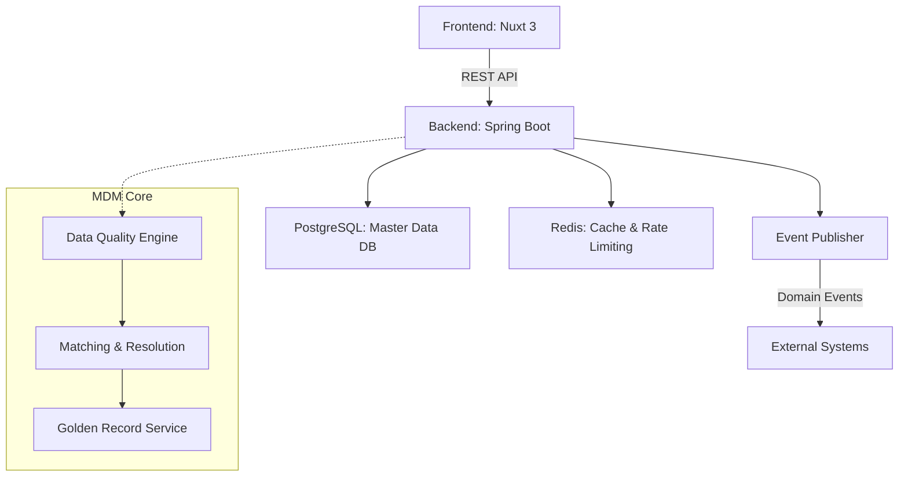

# Master Data Management (MDM) System

이 프로젝트는 조직 내 흩어진 핵심 데이터(Master Data)를 통합, 정제, 일관성 있게 관리하기 위한 Domain / Master Data Management(MDM) 시스템입니다.

## 🎯 Project Purpose
기업의 핵심 데이터인 Customer, Product 등의 마스터 데이터를 중앙 집중식으로 관리하여, 데이터의 일관성 및 품질을 확보하고 Golden Record를 생성하는 것을 목표로 합니다.

### Supported Domains
- **Customer**: 고객 기본 정보, 연락처 등
- **Product**: 상품 정보, 카테고리 등
- 향후 추가 도메인 확장 가능 구조 (Vendor, Employee 등)

## 🏛 Architecture Overview



## 🛠 Tech Stack
- **Frontend**: Nuxt 3, Vue 3, TypeScript, Vuestic UI
- **Backend**: Spring Boot 3.x, Java 17, Spring Data JPA, Spring Security, Spring Events
- **Database**: PostgreSQL 15, Redis
- **Infra**: Docker Compose

## 🚀 Quick Start

### 1. 환경 변수 설정
```bash
cp .env.example .env
# .env 파일을 열어 필요한 설정을 입력합니다.
```

### 2. 인프라 실행 (Docker Compose)
데이터베이스 및 기타 필수 인프라 컨테이너를 구동합니다.
```bash
docker-compose up -d
```

### 3. 백엔드 서버 구동
```bash
cd backend
./mvnw spring-boot:run
```

### 4. 프론트엔드 서버 구동
```bash
cd frontend
npm install
npm run dev
```

## 📚 Data Model 개요
시스템의 핵심 데이터 모델은 각 도메인별 Entity, Tenant 정보, 그리고 Audit 로그로 구성됩니다. 멀티 테넌시(Multi-tenancy)를 지원하여 단일 인스턴스에서 여러 조직의 데이터를 격리하여 관리할 수 있습니다.
